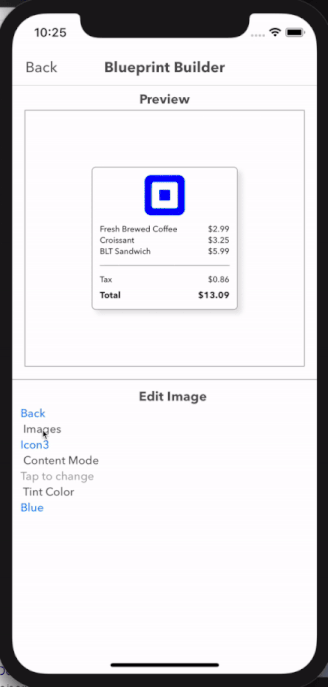
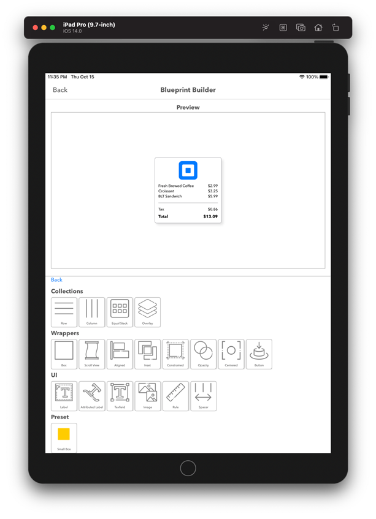
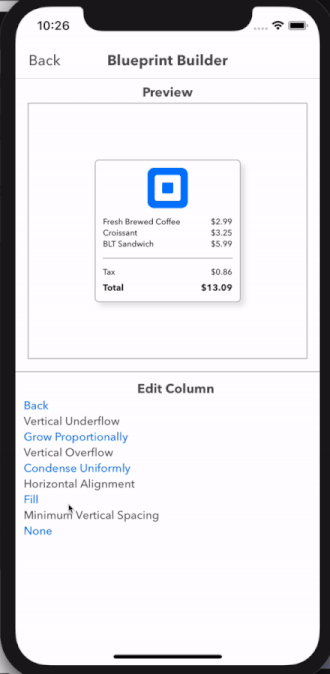
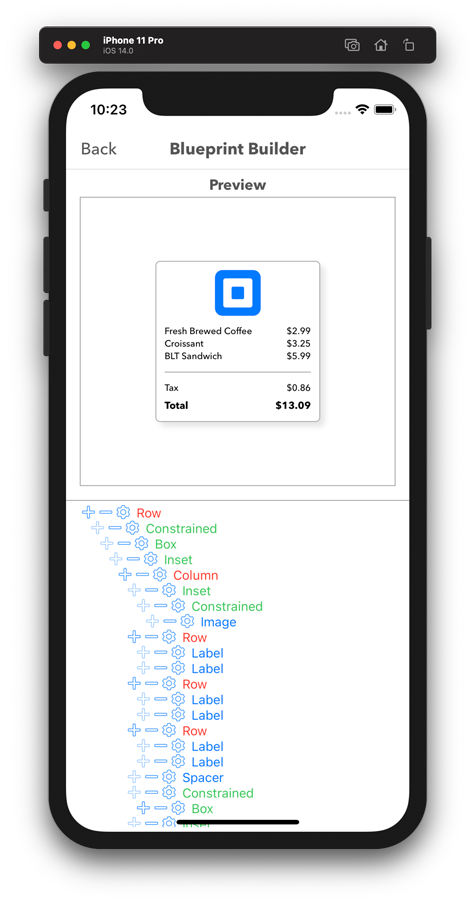

# Blueprint Builder
 An interactive interface builder for Blueprint. 

Blueprint Builder provides a set of Blueprint elements, an interactive canvas and a visual hierarchy for quick composition and testing of Blueprint elements.. 

What’s included:
1. Access to collection of basic elements provided through Blueprint.
    
    
    
2. Configurable elements for instant feedback 
    
    
    
3. Interactive component hierarchy
    
    
    
4. A set of already made template compositions
    
    
---

The app itself is also written using workflow and blueprint.

